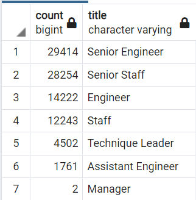

# Pewlett_Hackard_Analysis
## Overview of Analysis
### The purpose of this project is to help Bobby in HR plan for future vacancies due to impending retirements.

 

## Results
#### - There are currently 90,398 roles eligible for retirement in the coming year. The majority of which are either Senior Engineers (32.5%) or Senior Staff (31.3%).
 
  

#### - This table shows the total number of workers currently employed at Pewlett Hackard organized by department. 
   

#### - This table shows the total number of workers currently employed but eligible for retirement at Pewlett Hackard organized by department.
   

#### - This table shows the percentage of each department that is eligible for retirement in the coming year.
 
  

## Summary
### - How many roles will need to be filled as the "silver tsunami" begins to make an impact?
- There will be 90,398 roles to fill as employees retire as a part of the impending "Silver Tsunami."
- Approximately 15% of the entire workforce will be entering retirement in the near future.
- The distribution of employees is evenly spread across the different departments. About 15% for each...  

### Are there enough qualified, retirement-ready employees in the departments to mentor the next generation of Pewlett Hackard employees?
- Currently there is a lack of qualified, retirement-ready employees in their respective departments to mentor the next generation of Pewlett Hackard employees. 
- Only 1,550 employees are eligible for mentoring to help fill the 90,000+ vacant roles projected in the coming years. 
- That equates to an average of ~58 employees to mentor for each retiring position. 
- We believe this ratio to be too extreme for retiring employees to adequately train the next generation of workers and a organizational plan is needed to remedy the situation.